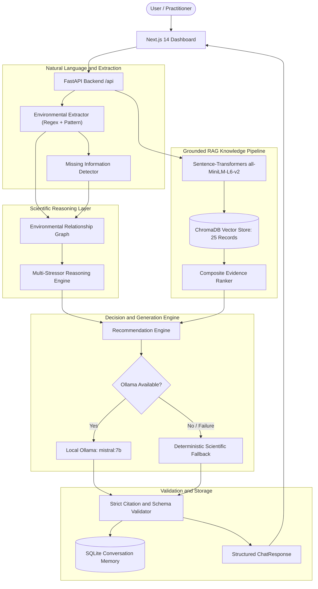

# Darukaa.Earth — AI Biodiversity Intelligence System

Darukaa.Earth is an AI-powered environmental intelligence platform engineered to reason like an environmental scientist. Rather than operating as a generic conversational chatbot, Darukaa.Earth extracts structured ecological profiles from natural language, traverses an explicit environmental relationship graph across multiple ecological stressors, queries a grounded ChromaDB vector store, and produces structured, evidence-backed intervention recommendations via local Ollama inference (with an automatic deterministic fallback).

---

## 1. System Architecture



---

## 2. RAG Knowledge Pipeline

The retrieval-augmented generation engine is designed around strict evidence grounding:
1. **Seed Knowledge Base**: 25 curated, non-fabricated scientific evidence records sourced from leading environmental and agricultural institutions (FAO, IPBES, IPCC, IUCN, ICAR, ICRISAT, CGIAR, USDA-NRCS, WWF, EFSA).
2. **Chunking & Storage**: Text records are stored with full metadata (organization, year, URL, topic, variables, region) in ChromaDB under `data/chroma`.
3. **Embeddings**: Utilizes `sentence-transformers/all-MiniLM-L6-v2` run locally without external API dependencies.
4. **Multi-Topic Querying**: Dynamically enriches queries with detected environmental stressors and queries across multiple relevant topic categories (e.g., `soil`, `climate`, `land_use`, `biodiversity`).
5. **Composite Evidence Ranking**: Ranks retrieved documents based on semantic similarity, topic relevance, variable overlap with the user profile, and authoritative institutional credibility.

---

## 3. Environmental Data Model

The system structures ecological parameters into an `EnvironmentalProfile` schema:
* **Soil Health**: `ph`, `organic_carbon_percent`, `moisture_percent`, `structure`, `nutrient_availability`, `microbial_activity`
* **Climate**: `rainfall_pattern` (`low`, `moderate`, `high`), `rainfall_mm`, `temperature_c`, `seasonality`, `drought_conditions`
* **Land Use**: `primary_type` (`cropland`, `degraded_land`, etc.), `cropping_system` (`monoculture`, `agroforestry`, etc.), `crop`
* **Biodiversity**: `species_richness` (`low`, `medium`, `high`), `habitat_diversity`, `pollinator_presence`, `native_vegetation_percent`, `ecological_connectivity`
* **Human Impact**: `pollution_level`, `pesticide_pressure`, `deforestation_pressure`, `habitat_disturbance`

---

## 4. Multi-Metric Reasoning Graph

The reasoning engine links compounding environmental stressors:
* `soil_organic_carbon` $\rightarrow$ `water_retention`, `microbial_activity`, `soil_fertility`, `plant_growth`
* `water_retention` $\rightarrow$ `vegetation_health`, `drought_resilience`, `habitat_quality`
* `rainfall` $\rightarrow$ `water_availability`, `vegetation_survival`, `habitat_persistence`
* `monoculture` $\rightarrow$ `habitat_diversity`, `soil_microbial_diversity`, `pollinator_decline`
* `biodiversity_decline` $\rightarrow$ `habitat_quality`, `species_survival`, `ecological_connectivity`
* `habitat_fragmentation` $\rightarrow$ `ecological_connectivity`, `species_survival`, `biodiversity`
* `deforestation` $\rightarrow$ `habitat_loss`, `carbon_stock`, `microclimate`, `species_richness`
* `pesticide_pressure` $\rightarrow$ `pollinator_decline`, `soil_microbial_activity`, `food_web`

When multiple stressors are detected simultaneously (e.g., SOC $< 0.6\%$, low rainfall, biodiversity decline), the engine synthesizes compound interventions (e.g., drought-adapted legume intercropping, conservation tillage, in-situ water harvesting, native hedgerows).

---

## 5. Ollama LLM & Fallback Mode

* **Local Model**: Uses `mistral:7b` via Ollama at `http://localhost:11434`.
* **Zero Paid APIs**: Runs completely locally without OpenAI, Anthropic, Gemini, or Groq API keys.
* **Strict Prompting Rules**:
  * Mandatory ground truth from retrieved evidence; no invented citations, authors, DOIs, or quantitative claims.
  * Multi-metric reasoning across at least two (preferably three) detected variables.
  * Rigorous confidence calibration: assigns `Medium` (instead of auto-`High`) when key site-specific variables (like soil pH or moisture) are unmeasured.
* **Citation Validation**: If the model cites a source not present in the retrieved ChromaDB documents, the citation validator strips or replaces it with an authentic retrieved document.
* **Deterministic Fallback (Demo Mode)**: If Ollama is offline or generation fails, the system automatically uses deterministic scientific template reasoning, clearly marked with a Demo Mode notice while maintaining full evidence citation integrity.

---

## 6. API Endpoints

| Method | Endpoint | Description |
|---|---|---|
| `GET` | `/health` | Basic liveness check |
| `GET` | `/api/system/status` | Component health: database, vector_db, embeddings, ollama_available, ollama_model, knowledge_base_docs, demo_mode |
| `POST` | `/api/chat` | Main conversational reasoning endpoint (returns recommendations, reasoning trace, updated profile) |
| `GET` | `/api/conversations/{id}` | Retrieve conversation history and persisted environmental profile |
| `POST` | `/api/environment/profile` | Set or update structured environmental profile directly |
| `GET` | `/api/environment/profile/{id}` | Get environmental profile for a conversation |
| `POST` | `/api/recommendations` | Direct recommendation generation from profile payload |
| `GET` | `/api/evidence/{rec_id}` | Retrieve evidence sources for a recommendation |
| `POST` | `/api/knowledge/ingest` | Re-index seed knowledge base into ChromaDB |
| `GET` | `/api/knowledge/stats` | Document count and collection statistics |

---

## 7. Environment Variables

### Backend (`backend/.env`):
```env
DATABASE_URL=sqlite+aiosqlite:///./darukaa.db
CHROMA_PERSIST_DIR=./data/chroma
EMBEDDING_MODEL=all-MiniLM-L6-v2
OLLAMA_BASE_URL=http://localhost:11434
OLLAMA_MODEL=mistral:7b
OLLAMA_TIMEOUT=120
DEBUG=false
CORS_ORIGINS=["http://localhost:3000"]
```

### Frontend (`frontend/.env.local`):
```env
NEXT_PUBLIC_API_URL=http://localhost:8000
```

---

## 8. Local Setup & Execution

### Prerequisites
* Python 3.11+
* Node.js 20+
* Ollama with `mistral:7b` (`ollama pull mistral:7b`)

### 1. Backend Setup
```bash
cd backend
python -m venv .venv
# Activate venv:
# Windows PowerShell: .\.venv\Scripts\Activate.ps1
# Linux/macOS: source .venv/bin/activate
pip install -r requirements.txt
python scripts/seed_database.py
python scripts/ingest_knowledge.py
uvicorn app.main:app --host 0.0.0.0 --port 8000
```

### 2. Frontend Setup
```bash
cd frontend
npm install
npm run build
npm run start   # or npm run dev for development
```

Access the UI at `http://localhost:3000`.

---

## 9. Verification & Testing

### Automated Backend Tests
Run the 27 unit and integration tests (uses mocked Ollama in CI so live LLM is not required):
```bash
cd backend
python -m pytest tests/ -v
```
Test suite coverage:
* `test_api.py`: `/health` and `/api/system/status` response schemas.
* `test_extractor.py`: Natural language profile extraction (SOC percentage variants, pH, rainfall, crops, monoculture distinction).
* `test_missing_info.py`: Detection of missing critical variables vs. complete profiles.
* `test_reasoning.py`: Knowledge graph traversal, active stressor resolution, biodiversity relationship tracing.
* `test_retrieval.py`: Real ChromaDB vector retrieval tests for SOC, monoculture, and low rainfall.
* `test_llm.py`: Prompt builder verification, structured JSON parsing, citation validation, hallucination rejection, and graceful fallback.

### Frontend Quality Verification
```bash
cd frontend
npm run lint    # 0 warnings, 0 errors
npm run build   # production build verification
```

---

## 10. Demo Walkthrough

1. Open `http://localhost:3000`.
2. Observe the top header status badge:
   * Displays **`Ollama LLM Active`** (green badge with brain icon) when connected to Ollama.
   * Displays **`Demo Mode Active`** (yellow badge) if running in fallback mode.
3. Load the **Semi-Arid Wheat Farm** scenario (or submit: *"My wheat farm in Maharashtra has low rainfall and I noticed biodiversity declining. Soil organic carbon is only 0.3%. What should I do?"*).
4. Inspect the **Context Profile** on the right panel: confirms region (Maharashtra), crop (wheat), rainfall (low), biodiversity (low), and SOC (0.3%).
5. Review the **Recommendation Cards**:
   * Specific actions (e.g., drought-tolerant legume cover crops, agroforestry buffers, conservation tillage).
   * Impacted metrics chips (`soil_organic_carbon`, `water_retention`, `biodiversity`).
   * Calibrated confidence badges (`Medium` due to unmeasured pH and moisture).
6. Click any **Supporting Evidence** link to open the **Evidence Drawer**, inspecting the full source organization, year, topic, variables, and supporting excerpt directly from the RAG store.
7. Expand the **Reasoning Trace** accordion to view the causal variable links traced by the relationship graph.

---

## 11. Infrastructure & Docker Status

* **Local Bare-Metal Environment**: The primary verification for this submission was conducted directly on Windows bare-metal with native Python virtualenv, Node.js, and Ollama.
* **Docker Setup**: A `docker-compose.yml` and backend/frontend `Dockerfile` definitions are provided in the repository for containerized deployment. However, because Docker was not locally installed/running in the audit environment, live Docker deployment was not actively tested and should be verified independently in a Docker-enabled container runtime.

---

## 12. Known Limitations

* **Model Latency**: Local 7B parameter inference on CPU or low-VRAM machines may take 15–40 seconds per query depending on hardware.
* **Static Vector Dataset**: The initial knowledge base contains 25 foundational scientific records. Additional research papers can be ingested via `POST /api/knowledge/ingest`.
* **Cropping System Inference**: The system strictly avoids inferring "monoculture" merely from phrases like "wheat farm" unless continuous monoculture practices are explicitly stated.
