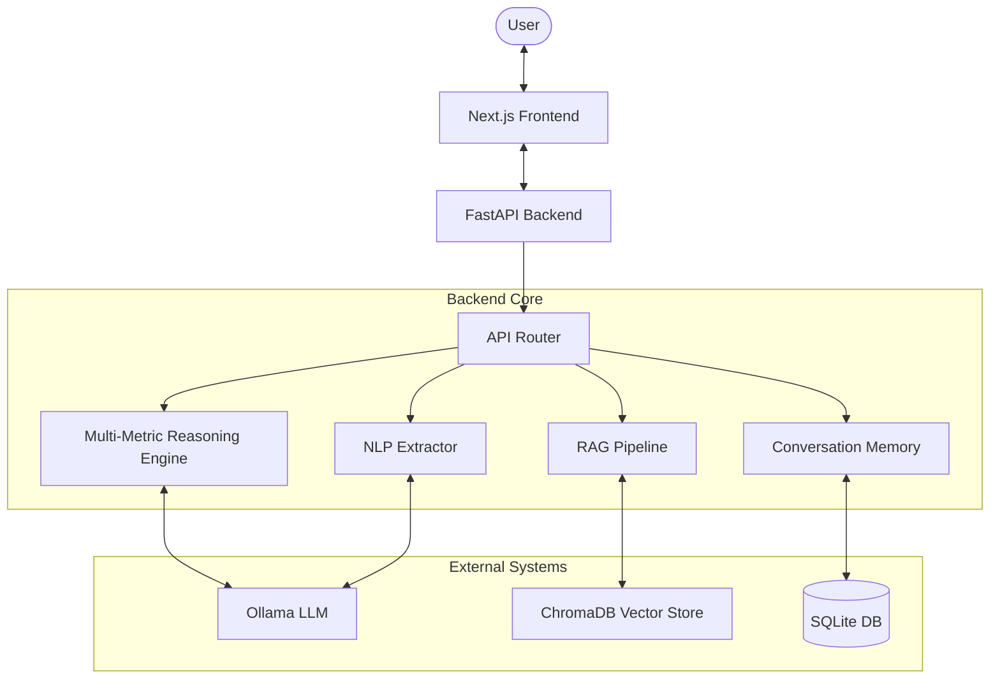

# Darukaa.Earth Architecture

## System Overview
Darukaa.Earth is an AI-powered environmental intelligence system that provides evidence-backed guidance for biodiversity and ecosystem restoration. It uses a Retrieval-Augmented Generation (RAG) pipeline combined with multi-metric reasoning to generate reliable recommendations.

## Component Diagram

## Data Flow
1. User provides natural language or structured environmental data.
2. The NLP Extractor parses unstructured text into a structured Environmental Profile.
3. The RAG Pipeline uses this context to retrieve relevant scientific evidence from ChromaDB.
4. The Reasoning Engine analyzes the evidence and profile against a relationship graph.
5. The LLM generates final recommendations grounded in the retrieved evidence.
6. The conversation is stored in SQLite for context in future turns.

## RAG Pipeline
The RAG pipeline relies on `sentence-transformers` for embeddings (all-MiniLM-L6-v2) and ChromaDB for vector storage. Documents are chunked contextually and stored with metadata like metric relationships and confidence levels. Retrieval uses hybrid search (vector + metadata filtering) to find the most relevant evidence.

## Reasoning Engine
The engine evaluates multi-metric relationships (e.g., how soil moisture affects biodiversity) using a predefined environmental relationship graph. This ensures the LLM's outputs are scientifically sound and consider multiple interacting variables.

## Database Schema
- **Conversations**: stores conversation metadata and context.
- **Messages**: stores chat history.
- **EnvironmentalProfiles**: stores structured data extracted from users.

## API Endpoints
| Method | Endpoint | Purpose |
|--------|----------|---------|
| GET | `/health` | System health |
| POST | `/api/chat` | Send message to AI |
| GET | `/api/conversations/{id}` | Retrieve chat history |
| POST | `/api/environment/profile` | Save profile |
| GET | `/api/environment/profile/{id}` | Get profile |
| POST | `/api/recommendations` | Generate recommendations |
| GET | `/api/evidence/{id}` | Get specific evidence |
